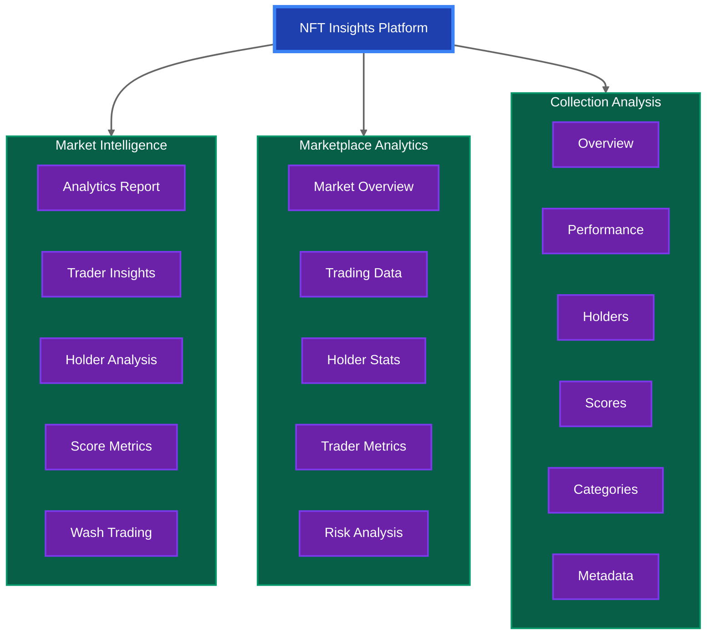

# NFT Insights

A comprehensive NFT analytics platform providing market intelligence and collection insights powered by bitsCrunch APIs.

## 🌟 Project Overview



## 🚀 Project Structure

```
src/
├── api/
│   ├── endpoints.js                    # API configuration
│   └── nftInsightsEndpoints.js         # bitsCrunch API integration
├── components/
│   ├── nft/                           # NFT Insights components
│   │   ├── NFTAnalyticsDashboard.js   # Analytics dashboard
│   │   ├── NFTScoresInsights.js       # Scoring metrics
│   │   ├── NFTholdersinsights.js      # Holder analysis
│   │   ├── nftmarketanalyticsreport.js# Market analytics
│   │   ├── nfttradersinsights.js      # Trader insights
│   │   └── nftwashtradeinsights.js    # Wash trade detection
│   ├── shared/                        # Shared components
│   │   ├── FuturisticCard.js         # Card component
│   │   ├── FuturisticTable.js        # Table component
│   │   ├── FuturisticSelect.js       # Select input
│   │   └── LoadingSpinner.js         # Loading state
│   ├── Home.js                        # Main dashboard
│   ├── Navbar.js                      # Navigation
│   ├── CollectionAnalytics.js         # Collection metrics
│   ├── CollectionCategories.js        # Category analysis
│   ├── CollectionHolders.js           # Holder metrics
│   ├── CollectionMetadata.js          # Metadata analysis
│   ├── CollectionOverview.js          # Overview dashboard
│   ├── CollectionScores.js            # Scoring system
│   ├── CollectionTraders.js           # Trader analysis
│   ├── CollectionWashtrade.js         # Wash trade detection
│   ├── NftMarketplace.js             # Marketplace data
│   └── NftMarketplaceOverview.js     # Market overview
├── context/
│   └── ThemeContext.js               # Theme management
└── App.js                            # Main application routes
```

## 💡 Key Features

### 1. NFT Market Insights
- Market Analytics Report: Comprehensive market analysis
- Traders Insights: Trading patterns and metrics
- Holders Insights: Holder distribution and analysis
- Scores Insights: NFT valuation metrics
- Wash Trade Detection: Identify suspicious patterns

### 2. NFT Marketplace Analytics
- Marketplace Overview: Key marketplace metrics
- Trading Analytics: Volume and transaction data
- Holder Analysis: Distribution of holdings
- Trader Metrics: Active trader analysis
- Wash Trading Detection: Market manipulation checks

### 3. Collection Analysis
- Collection Overview: Key performance indicators
- Analytics Dashboard: Detailed metrics
- Holder Analysis: Holder distribution
- Scoring System: Collection rating
- Trading Analysis: Volume and patterns
- Category Analysis: Collection categorization
- Metadata Analysis: Attribute exploration
- Wash Trade Detection: Suspicious activity monitoring

## 🛠 Technical Implementation

### Frontend Architecture
- **Framework**: React 19.0.0
- **Routing**: React Router v7
- **State Management**: Context API
- **Styling**: Tailwind CSS + Framer Motion
- **Data Visualization**: Recharts
- **Icons**: React Icons

### bitsCrunch API Integration

The project demonstrates two approaches to API integration:

1. **Centralized API Service** (in `nft/` components)
```javascript
// nftInsightsEndpoints.js
const NFT_INSIGHTS_ENDPOINTS = {
  HOLDERS: '/holders',
  TRADERS: '/traders',
  SCORES: '/scores',
  WASH_TRADE: '/washtrade',
  MARKET_ANALYTICS: '/analytics',
  MARKET_SCORES: '/market-scores'
};

export const NFTInsightsAPI = {
  getHoldersInsights: () => {...},
  getTradersInsights: () => {...},
  getScoresInsights: () => {...},
  // ...other methods
};
```

2. **Direct API Integration** (in marketplace and collection components)
```javascript
// Example from marketplace components
const fetchData = async () => {
  const options = {
    method: 'GET',
    headers: { 
      accept: 'application/json', 
      'x-api-key': process.env.REACT_APP_X_API_KEY 
    }
  };

  const response = await fetch(
    'https://api.unleashnfts.com/api/v2/nft/marketplace/...',
    options
  );
  const data = await response.json();
  // Process data...
};
```

### Key API Endpoints

1. **NFT Market Insights**
   - `/market/analytics`: Market overview and metrics
   - `/market/traders`: Trading activity analysis
   - `/market/holders`: Holder distribution data
   - `/market/scores`: Market scoring metrics
   - `/market/washtrade`: Wash trading detection

2. **Marketplace Analytics**
   - `/marketplace/overview`: General marketplace data
   - `/marketplace/holders`: Holder statistics
   - `/marketplace/traders`: Trading activity
   - `/marketplace/washtrade`: Suspicious activity

3. **Collection Analysis**
   - `/collection/analytics`: Collection metrics
   - `/collection/holders`: Holder information
   - `/collection/scores`: Collection scoring
   - `/collection/metadata`: Collection attributes
   - `/collection/categories`: Category data

### Authentication
- All API requests require an API key
- Key is stored in `.env` as `REACT_APP_X_API_KEY`
- Secured headers using environment variables

## 🚀 Getting Started

1. **Clone & Install**
   ```bash
   git clone https://github.com/himanshu-sugha/nft
   npm install
   ```

2. **Environment Setup**
   Create a .env file:
   ```env
   REACT_APP_X_API_KEY=your_bitscrunch_api_key_here
   ```

3. **Development**
   ```bash
   npm start
   ```

4. **Production Build**
   ```bash
   npm run build
   ```

## 🔧 Available Scripts

- `npm start`: Run development server
- `npm test`: Run test suite
- `npm run build`: Create production build
- `npm run eject`: Eject from Create React App

## 📫 Contact & Support

himanshusugha@gmail.com

---
Built with ❤️ by Himanshu Sugha
