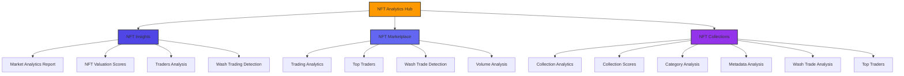
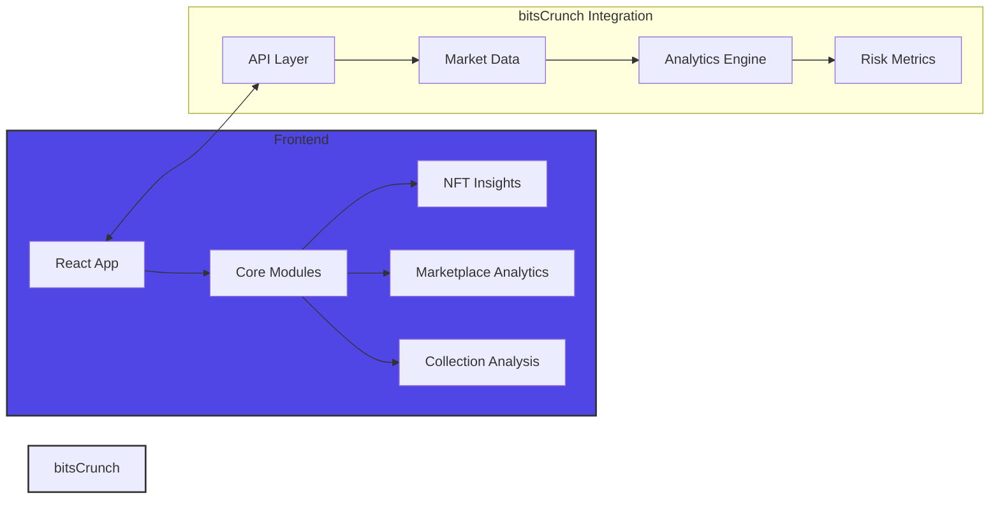

# NFT Analytics Hub

Powered by bitsCrunch APIs - A comprehensive NFT analytics platform providing real-time market intelligence, collection insights, and advanced trading analysis.

## 🌟 Core Features



## 🚀 Quick Start

1. Clone the repository
```bash
git clone https://github.com/himanshu-sugha/nft.git
cd nft
```

2. Install dependencies
```bash
npm install
```

3. Create `.env` file with your bitsCrunch API key
```bash
REACT_APP_X_API_KEY=your_bitscrunch_api_key_here
```

4. Start the development server
```bash
npm start
```

## 🏗 Architecture



## 📊 Key Metrics

### NFT Insights
- Market Cap Analysis
- 24h Volume Tracking
- Real-time Market Trends
- AI-powered Valuation
- Trading Pattern Analysis
- Wash Trading Detection

### NFT Marketplace
- Active Trader Tracking
- Total Volume Analysis
- Cross-marketplace Metrics
- Trader Performance
- Suspicious Pattern Detection
- Volume Breakdown

### NFT Collections
- Top Collections Ranking
- Collection Scoring
- Performance Analytics
- Category-wise Insights
- Attribute Analysis
- Trader Analytics

## 🛠 Technology Stack

- **Frontend**: React.js with Hooks
- **Routing**: React Router v6
- **State Management**: React Context
- **UI Framework**: TailwindCSS
- **Animations**: Framer Motion
- **Icons**: React Icons (Fa)
- **Charts**: Recharts
- **API**: bitsCrunch NFT Analytics

## 📱 Key Components

### NFT Insights Module
- Market Analytics Dashboard
- Valuation Score System
- Trading Pattern Analysis
- Wash Trade Detection Engine

### Marketplace Analytics
- Real-time Trading Metrics
- Top Trader Rankings
- Wash Trading Scanner
- Volume Analytics

### Collection Analysis
- Performance Metrics
- AI-based Scoring
- Category Analysis
- Metadata Explorer
- Wash Trade Monitor
- Trader Tracking

## 🎨 UI Features

- Animated Background
- Dark/Light Theme
- Gradient Text Effects
- Loading Animations
- Error Handling
- Responsive Design
- Interactive Cards

## 🔒 Security

- Environment Variables
- API Key Management
- Error Boundaries
- Data Validation
- Secure Routing

## 📖 API Integration

Comprehensive integration with bitsCrunch APIs:

- Market Analytics Endpoints
- Collection Data Endpoints
- Trader Analysis Endpoints
- Wash Trading Detection
- Valuation Metrics

## 🤝 Contributing

1. Fork the repository
2. Create feature branch (`git checkout -b feature/AmazingFeature`)
3. Commit changes (`git commit -m 'Add AmazingFeature'`)
4. Push to branch (`git push origin feature/AmazingFeature`)
5. Open a Pull Request

## 📄 License

This project is licensed under the MIT License - see the [LICENSE](LICENSE) file for details.

## 🙏 Acknowledgments

- bitsCrunch for their comprehensive NFT analytics APIs
- Open-source community
- Contributors and testers

## 📞 Support

For support and queries:
- Create an issue in the repository
- Email: support@nftinsights.com
- Discord: [NFT Insights Community](https://discord.gg/nftinsights)
