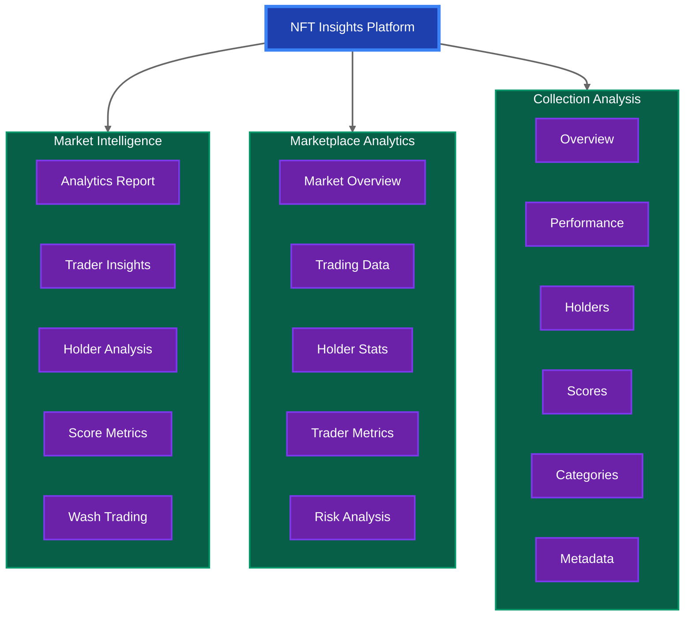

#  NFT Insights

A comprehensive NFT analytics platform providing market intelligence and collection insights powered by bitsCrunch APIs.

<div align="center">


</div>

## 🌟 Project Overview



## 💡 Key Features

### 1. NFT Market Insights
- **Market Analytics Report**: Comprehensive market analysis with real-time data
- **Traders Insights**: Advanced trading patterns and metrics
- **Holders Insights**: Detailed holder distribution and analysis
- **Scores Insights**: NFT valuation metrics and scoring system
- **Wash Trade Detection**: Advanced algorithms to identify suspicious patterns

### 2. NFT Marketplace Analytics
- **Marketplace Overview**: Real-time key marketplace metrics
- **Trading Analytics**: Detailed volume and transaction data
- **Holder Analysis**: In-depth distribution of holdings
- **Trader Metrics**: Comprehensive active trader analysis
- **Wash Trading Detection**: Sophisticated market manipulation checks

### 3. Collection Analysis
- **Collection Overview**: Real-time key performance indicators
- **Analytics Dashboard**: Comprehensive metrics visualization
- **Holder Analysis**: Detailed holder distribution patterns
- **Scoring System**: Advanced collection rating algorithms
- **Trading Analysis**: In-depth volume and pattern analysis
- **Category Analysis**: Smart collection categorization
- **Metadata Analysis**: Detailed attribute exploration
- **Wash Trade Detection**: AI-powered suspicious activity monitoring

### 🔌 bitsCrunch API Integration

The project demonstrates two approaches to API integration:

1. **Centralized API Service** (in `nft/` components)
```javascript
const NFT_INSIGHTS_ENDPOINTS = {
  HOLDERS: '/holders',
  TRADERS: '/traders',
  SCORES: '/scores',
  WASH_TRADE: '/washtrade',
  MARKET_ANALYTICS: '/analytics',
  MARKET_SCORES: '/market-scores'
};

export const NFTInsightsAPI = {
  getHoldersInsights: (params) => buildUrl(ENDPOINTS.HOLDERS, params),
  getTradersInsights: (params) => buildUrl(ENDPOINTS.TRADERS, params),
  getScoresInsights: (params) => buildUrl(ENDPOINTS.SCORES, params),
  // ...other methods
};
```

2. **Direct API Integration** (in marketplace and collection components)
```javascript
const fetchData = async (timeRange = '24h') => {
  const options = {
    method: 'GET',
    headers: { 
      accept: 'application/json', 
      'x-api-key': process.env.REACT_APP_X_API_KEY 
    }
  };

  const response = await fetch(
    `https://api.unleashnfts.com/api/v2/nft/marketplace/analytics?timeRange=${timeRange}`,
    options
  );
  const data = await response.json();
  // Process data...
};
```
### ⏰ Time-Based Analytics
```javascript
const timeRangeOptions = [
  { value: '15m', label: 'Last 15 Minutes', description: 'Most recent market insights' },
  { value: '30m', label: 'Last 30 Minutes', description: 'Short-term market trends' },
  { value: '24h', label: 'Last 24 Hours', description: 'Daily market overview' },
  { value: '7d', label: 'Last 7 Days', description: 'Weekly analysis' },
  { value: '30d', label: 'Last 30 Days', description: 'Monthly trends' },
  { value: '90d', label: 'Last 90 Days', description: 'Quarterly view' },
  { value: 'all', label: 'All Time', description: 'Complete history' }
];
```

## 📁 Project Structure

```
src/
├── api/
│   ├── endpoints.js                    # API configuration
│   └── nftInsightsEndpoints.js         # bitsCrunch API integration
├── components/
│   ├── nft/                           # NFT Insights components
│   │   ├── NFTAnalyticsDashboard.js   # Analytics dashboard
│   │   ├── NFTScoresInsights.js       # Scoring metrics
│   │   ├── NFTholdersinsights.js      # Holder analysis
│   │   ├── nftmarketanalyticsreport.js# Market analytics
│   │   ├── nfttradersinsights.js      # Trader insights
│   │   └── nftwashtradeinsights.js    # Wash trade detection
│   ├── shared/                        # Shared components
│   │   ├── FuturisticCard.js         # Card component
│   │   ├── FuturisticTable.js        # Table component
│   │   ├── FuturisticSelect.js       # Select input
│   │   └── LoadingSpinner.js         # Loading state
│   ├── Home.js                        # Main dashboard
│   ├── Navbar.js                      # Navigation
│   ├── CollectionAnalytics.js         # Collection metrics
│   ├── CollectionCategories.js        # Category analysis
│   ├── CollectionHolders.js           # Holder metrics
│   ├── CollectionMetadata.js          # Metadata analysis
│   ├── CollectionOverview.js          # Overview dashboard
│   ├── CollectionScores.js            # Scoring system
│   ├── CollectionTraders.js           # Trader analysis
│   ├── CollectionWashtrade.js         # Wash trade detection
│   ├── NftMarketplace.js             # Marketplace data
│   └── NftMarketplaceOverview.js     # Market overview
├── context/
│   └── ThemeContext.js               # Theme management
└── App.js                            # Main application routes
```


## 🛠 Technical Implementation

### Frontend Architecture
- **Framework**: React 19.0.0
- **Routing**: React Router v7
- **State Management**: Context API
- **Styling**: Tailwind CSS + Framer Motion
- **Data Visualization**: Recharts
- **Icons**: React Icons


### 🔑 Key API Endpoints

1. **NFT Market Insights**
   - `/market/analytics`: Real-time market overview and metrics
   - `/market/traders`: Live trading activity analysis
   - `/market/holders`: Historical holder distribution data
   - `/market/scores`: Dynamic market scoring metrics
   - `/market/washtrade`: Real-time wash trading detection

2. **Marketplace Analytics**
   - `/marketplace/overview`: Live marketplace data
   - `/marketplace/holders`: Real-time holder statistics
   - `/marketplace/traders`: Active trading monitoring
   - `/marketplace/washtrade`: Instant suspicious activity alerts

3. **Collection Analysis**
   - `/collection/analytics`: Real-time collection metrics
   - `/collection/holders`: Live holder information
   - `/collection/scores`: Dynamic collection scoring
   - `/collection/metadata`: Updated collection attributes
   - `/collection/categories`: Real-time category data

### 🔒 Security & Performance
- API requests secured with API key authentication
- Environment variables for secure key storage
- Request rate limiting and throttling
- Response caching for optimal performance
- Real-time data validation and sanitization

## 🚀 Getting Started

1. **Clone & Install**
   ```bash
   git clone https://github.com/himanshu-sugha/nft
   cd nft
   npm install
   ```

2. **Environment Setup**
   Create a .env file:
   ```env
   REACT_APP_X_API_KEY=your_bitscrunch_api_key_here
   ```

3. **Development**
   ```bash
   npm start
   ```

4. **Production Build**
   ```bash
   npm run build
   ```


## 📫 Contact & Support

- **Developer**: Himanshu Sugha
- **Email**: himanshusugha@gmail.com

---
<div align="center">
Built with ❤️ by Himanshu Sugha
</div>
