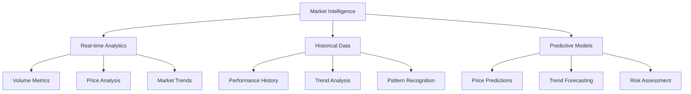
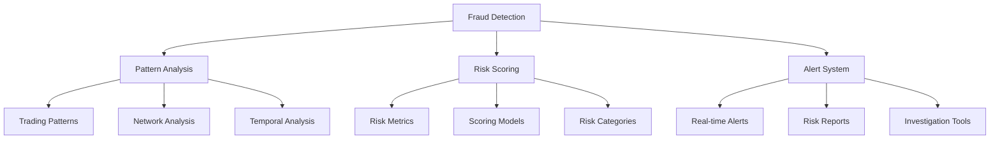
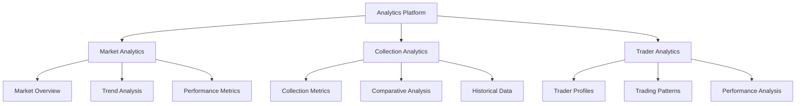

# Vision: NFT Insights Platform

## Mission Statement

To provide the most comprehensive, reliable, and user-friendly NFT analytics platform that empowers traders, collectors, and analysts with real-time market intelligence and advanced analytical tools powered by bitsCrunch APIs.

## Problem Statement

The NFT market faces several critical challenges that hinder its mainstream adoption and trustworthiness:

1. **Market Opacity**: 
   - Lack of transparent, real-time market data
   - Difficulty in tracking market trends and patterns
   - Limited access to historical performance data
   - Inconsistent time-series data across platforms

2. **Fraud & Wash Trading**:
   - Sophisticated market manipulation techniques
   - Difficulty in identifying suspicious trading patterns
   - Need for real-time fraud detection systems
   - Temporal pattern analysis challenges

3. **Valuation Complexity**:
   - Absence of standardized valuation metrics
   - Difficulty in assessing true NFT worth
   - Limited understanding of value drivers
   - Time-sensitive pricing dynamics

4. **Data Fragmentation**:
   - Scattered data across multiple marketplaces
   - Inconsistent data formats and standards
   - Need for unified analytics platform
   - Real-time data synchronization issues

## Solution Architecture

Our NFT Insights platform leverages bitsCrunch APIs to build three robust pillars:

### 1. Market Intelligence Engine

### 2. Fraud Detection System

### 3. Analytics Dashboard

## Technical Implementation

### Current Features
1. **Time-Based Analytics**
   - Granular time range options (15m to All-time)
   - Real-time data updates
   - Historical trend analysis
   - Time-series visualizations

2. **bitsCrunch API Integration**
   - Centralized API service
   - Direct component integration
   - Secure authentication
   - Rate limiting and caching

3. **Advanced Analytics**
   - Market intelligence reports
   - Trader behavior analysis
   - Holder distribution tracking
   - Wash trading detection

### Technology Stack
- **Frontend**: React 19.0.0
- **Routing**: React Router v7
- **State Management**: Context API
- **UI/UX**: Tailwind CSS + Framer Motion
- **Data Visualization**: Recharts
- **API Integration**: bitsCrunch APIs

## Conclusion

NFT Insights, powered by bitsCrunch APIs, aims to revolutionize the NFT analytics space by providing comprehensive, real-time, and actionable insights. Our platform combines advanced time-based analytics, sophisticated fraud detection, and intuitive visualization tools to empower users in the dynamic NFT marketplace.

---
Built with ❤️ by Himanshu Sugha
