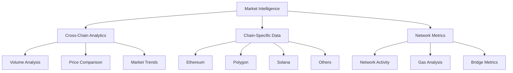
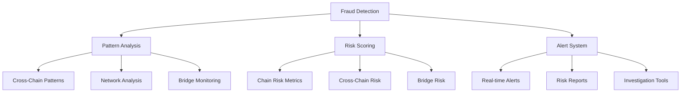
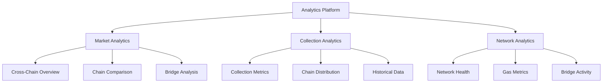

# Vision: NFT Insights Platform

## Mission Statement

To provide the most comprehensive, reliable, and user-friendly NFT analytics platform that empowers traders, collectors, and analysts with real-time market intelligence and advanced analytical tools powered by bitsCrunch APIs.

## Problem Statement

The NFT market faces several critical challenges that hinder its mainstream adoption and trustworthiness:

1. **Market Opacity**: 
   - Lack of transparent, real-time market data
   - Difficulty in tracking market trends and patterns
   - Limited access to historical performance data
   - Inconsistent time-series data across platforms

2. **Cross-Chain Complexity**:
   - Fragmented data across multiple blockchains
   - Inconsistent standards between chains
   - Difficulty in cross-chain value comparison
   - Chain-specific market dynamics

3. **Fraud & Wash Trading**:
   - Sophisticated market manipulation techniques
   - Difficulty in identifying suspicious trading patterns
   - Need for real-time fraud detection systems
   - Cross-chain wash trading detection

4. **Valuation Complexity**:
   - Chain-specific valuation metrics
   - Network-dependent pricing models
   - Cross-chain value comparison challenges
   - Time-sensitive pricing dynamics

5. **Data Fragmentation**:
   - Scattered data across multiple marketplaces and chains
   - Inconsistent data formats and standards
   - Need for unified analytics platform
   - Real-time data synchronization issues

## Solution Architecture

Our NFT Insights platform leverages bitsCrunch APIs to build three robust pillars:

### 1. Multi-Chain Market Intelligence


### 2. Cross-Chain Fraud Detection


### 3. Unified Analytics Dashboard


## Technical Implementation

### Current Features
1. **Multi-Chain Support**
   - Ethereum Mainnet analytics
   - Polygon Network integration
   - Solana ecosystem support
   - BNB Chain analytics
   - Avalanche integration
   - Cross-chain metrics

2. **Chain-Specific Features**
   - Network-specific metrics
   - Gas price analytics
   - Bridge monitoring
   - Chain comparison tools

3. **Cross-Chain Analytics**
   - Unified market view
   - Cross-chain value comparison
   - Bridge transaction monitoring
   - Multi-chain portfolio tracking

### Technology Stack
- **Frontend**: React 19.0.0
- **Routing**: React Router v7
- **State Management**: Context API
- **UI/UX**: Tailwind CSS + Framer Motion
- **Data Visualization**: Recharts
- **API Integration**: bitsCrunch APIs

### API Implementation
```javascript
// Blockchain support
const SUPPORTED_CHAINS = {
  ETHEREUM: 'ethereum',
  POLYGON: 'polygon',
  SOLANA: 'solana',
  BINANCE: 'binance',
  AVALANCHE: 'avalanche'
};

// Chain-specific API calls
const getChainMetrics = async (chain) => {
  return await fetch(`/api/v2/metrics/${chain}`);
};

// Cross-chain analytics
const getCrossChainAnalytics = async () => {
  const metrics = await Promise.all(
    Object.values(SUPPORTED_CHAINS)
      .map(chain => getChainMetrics(chain))
  );
  return unifyMetrics(metrics);
};
```

## Conclusion

NFT Insights, powered by bitsCrunch APIs, aims to revolutionize the NFT analytics space by providing comprehensive, real-time, and actionable insights across multiple blockchain networks. Our platform combines advanced cross-chain analytics, sophisticated fraud detection, and intuitive visualization tools to empower users in the dynamic NFT marketplace.

---
Built with ❤️ by Himanshu Sugha
