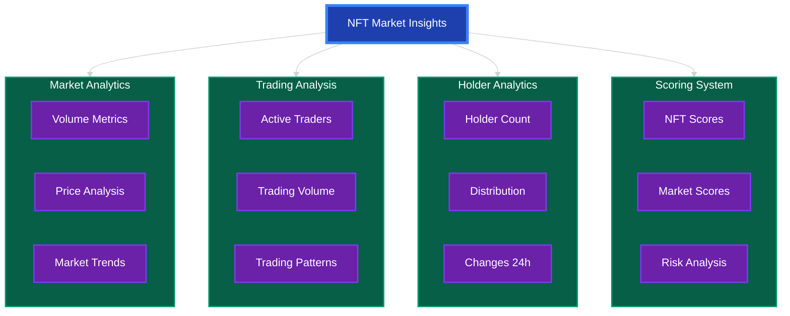
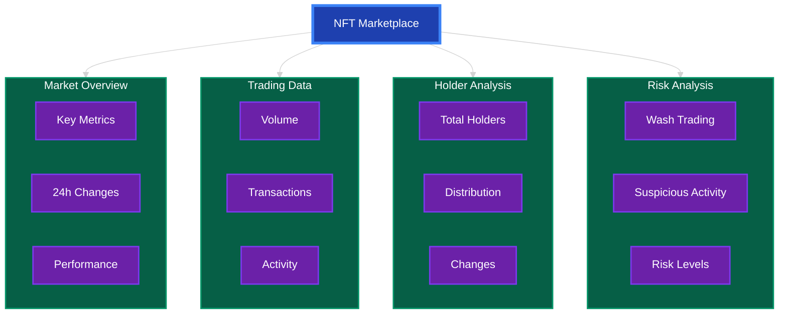
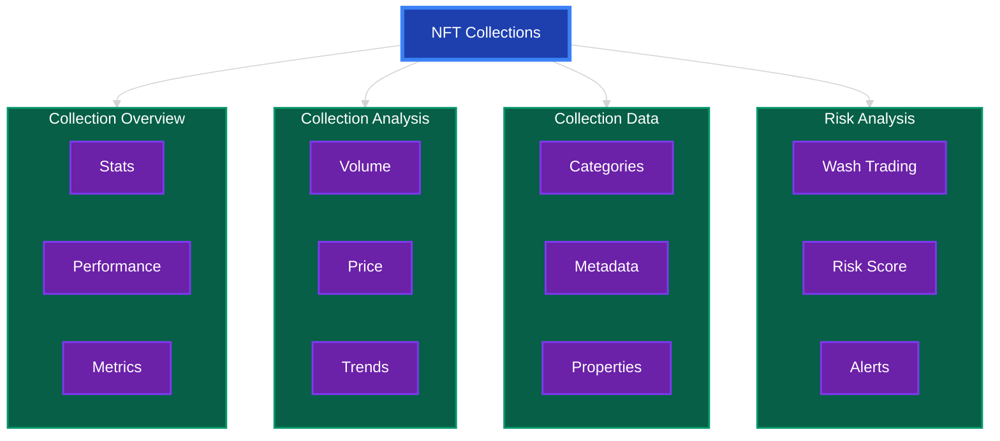

# Vision: NFT Insights

## Problem Statement

The NFT market faces several critical challenges that hinder its mainstream adoption and trustworthiness:

1. **Market Opacity**: Lack of transparent, real-time market data makes it difficult for investors to make informed decisions.
2. **Fraud & Wash Trading**: Manipulative trading practices distort market values and erode trust.
3. **Valuation Complexity**: Absence of standardized valuation metrics makes it challenging to assess NFT worth.
4. **Data Fragmentation**: Scattered data across multiple marketplaces creates information asymmetry.

## Solution Architecture

Our NFT Insights platform is structured into three main components, each addressing specific market needs:

### 1. NFT Market Insights

### 2. NFT Marketplace

### 3. NFT Collections

## Technical Implementation

### Frontend Architecture
1. **Core Components**
   - React-based modular design
   - Context-based theme management
   - API integration hooks
   - Responsive layouts

2. **Data Visualization**
   - Interactive charts using Recharts
   - Data filtering capabilities
   - Loading states
   - Error handling

3. **User Experience**
   - Intuitive navigation
   - Dark/Light theme
   - Loading indicators
   - Error messages

### API Integration
1. **bitsCrunch APIs**
   - Market data endpoints
   - Collection data
   - Trading metrics
   - Wash trading detection

2. **Data Processing**
   - Data transformation
   - Response formatting
   - Error handling
   - Data validation

## Success Metrics

1. **User Experience**
   - Page load times
   - Navigation flow
   - Error rates
   - User feedback

2. **Data Quality**
   - API response times
   - Data accuracy
   - Update frequency
   - Error handling

3. **Platform Usage**
   - User engagement
   - Feature adoption
   - Page views
   - Session duration

## Conclusion

NFT Insights provides a comprehensive solution for NFT market analysis through bitsCrunch APIs, offering transparency and insights for better decision-making in the NFT space.

---
Built with ❤️ by Himanshu Sugha
