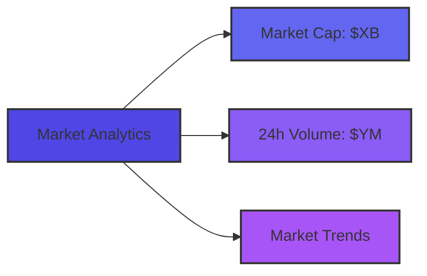
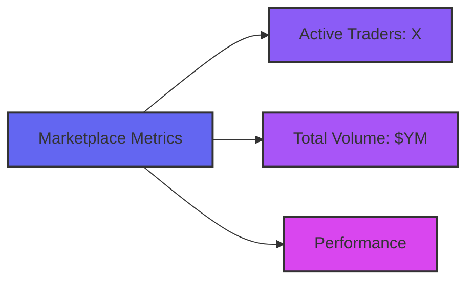
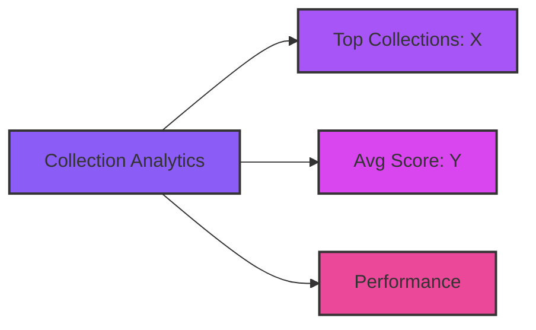
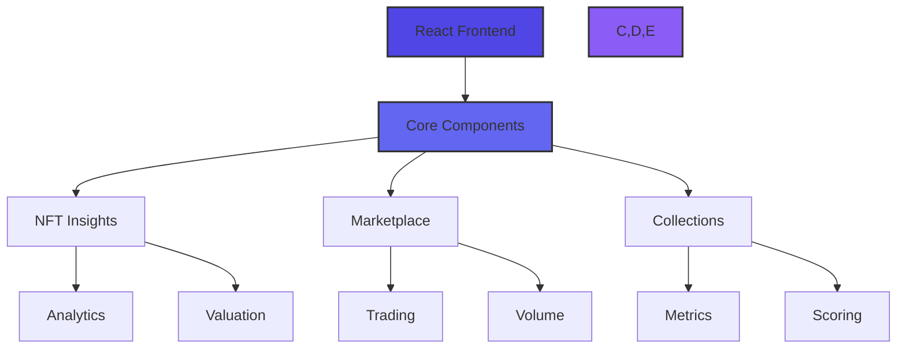

# Vision: NFT Analytics Hub

## Market Overview

The NFT Analytics Hub provides comprehensive insights across three core pillars:

### 1. NFT Insights

**Key Features:**
- Real-time NFT market trends and analysis
- AI-powered valuation metrics for NFTs
- In-depth analysis of NFT trading patterns
- Advanced wash trading detection system

### 2. NFT Marketplace Analytics

**Key Features:**
- Real-time trading metrics and volume analysis
- Leading traders and their performance metrics
- Suspicious trading pattern identification
- Detailed marketplace volume breakdown

### 3. NFT Collections

**Key Features:**
- Performance metrics and trend analysis
- AI-based collection rating system
- Category-wise collection insights
- Detailed attribute and rarity analysis
- Collection-specific wash trading detection
- Leading traders within collections

## Technical Implementation

### Frontend Architecture

### Key Technologies
- **Frontend**: React.js with Context API
- **Styling**: TailwindCSS with custom animations
- **Data Viz**: Recharts for advanced analytics
- **API**: bitsCrunch NFT Analytics integration
- **Animation**: Framer Motion
- **Icons**: React Icons (Fa)

### UI/UX Features
- Animated gradient backgrounds
- Dark/Light theme support
- Interactive data visualizations
- Real-time data updates
- Loading states and error handling
- Responsive design
- Gradient text effects

## Data Integration

### bitsCrunch API Integration
- Market analytics endpoints
- Collection data endpoints
- Trading metrics endpoints
- Wash trading detection
- Valuation scoring system

### Real-time Metrics
- Market capitalization
- 24-hour trading volume
- Active trader count
- Collection performance
- Wash trading indicators
- Valuation scores

## Target Users

### 1. NFT Traders
**Needs:**
- Market cap and volume trends
- Trading pattern analysis
- Wash trading alerts
- Collection performance metrics

### 2. Market Analysts
**Needs:**
- Cross-marketplace analytics
- Trading volume breakdown
- Active trader metrics
- Collection categorization

### 3. Collection Owners
**Needs:**
- Collection scoring
- Performance analytics
- Trader analysis
- Wash trading detection

## Future Development

### 1. Enhanced Analytics
- Advanced statistical models
- Machine learning integration
- Predictive analytics
- Custom metrics

### 2. User Features
- Personalized dashboards
- Custom alerts
- Portfolio tracking
- API access

### 3. Market Intelligence
- Market sentiment analysis
- Trend prediction
- Risk assessment
- Cross-chain analytics

## Impact

Our platform aims to:
1. Enhance market transparency
2. Identify market manipulation
3. Improve trading decisions
4. Support collection growth
5. Foster market integrity

## Join Us

Help build the future of NFT analytics:
- Contribute to development
- Provide feedback
- Share insights
- Join our community

---

Building the most comprehensive NFT analytics platform, powered by bitsCrunch.
